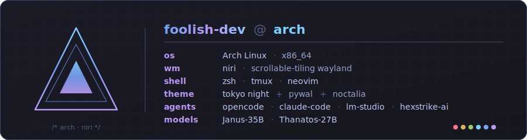

<p align="center">
  <picture>
    <source media="(prefers-color-scheme: dark)" srcset="https://raw.githubusercontent.com/foolish-dev/foolish-dev/main/assets/banner.svg"/>
    <source media="(prefers-color-scheme: light)" srcset="https://raw.githubusercontent.com/foolish-dev/foolish-dev/main/assets/banner-light.svg"/>
    
  </picture>
</p>

<p align="center">
  <a href="https://github.com/foolish-dev">
    <picture>
      <source media="(prefers-color-scheme: dark)" srcset="https://readme-typing-svg.demolab.com?font=JetBrains+Mono&weight=600&size=20&duration=2800&pause=600&color=7AA2F7&center=true&vCenter=true&width=720&lines=%2F%2F+scrollable-tiling+wayland;%2F%2F+offensive+security+operator;%2F%2F+AI-augmented+developer;%2F%2F+terminal-first%2C+keyboard-driven"/>
      <source media="(prefers-color-scheme: light)" srcset="https://readme-typing-svg.demolab.com?font=JetBrains+Mono&weight=600&size=20&duration=2800&pause=600&color=2E7DE9&center=true&vCenter=true&width=720&lines=%2F%2F+scrollable-tiling+wayland;%2F%2F+offensive+security+operator;%2F%2F+AI-augmented+developer;%2F%2F+terminal-first%2C+keyboard-driven"/>
      
    </picture>
  </a>
</p>

<p align="center">
  
  
  
  
  
  
  
</p>

---

```text
~ ❯ cat .profile

stack         arch · niri · zsh · tmux · neovim
agents        opencode · claude-code · lm-studio · hexstrike-ai mcp
discipline    offensive security · automation · LLM tooling
theme         tokyo night + pywal (wallpaper-driven)
mirror        github → huggingface.co/FoolDev (auto-synced)
ethos         terminal-first, keyboard-driven, fully reproducible
```

### Now

<sub>// current rotation — what I'm shipping, breaking, and iterating on right now</sub>

- Driving [opencode](https://opencode.ai) + Claude Code side-by-side as daily coding agents.
- Hardening a [scrollable-tiling Wayland workstation](https://github.com/foolish-dev/niri-dotfiles) — Niri, Noctalia, pywal.
- Agentic offensive security — local LLMs into MCP-backed recon via [HexStrike AI](https://github.com/0x4m4/hexstrike-ai).
- Shipping [heretic](https://github.com/p-e-w/heretic) abliteration runs to Hugging Face — [Janus](https://huggingface.co/FoolDev/janus) (35B-A3B MoE) and [Janus-27B](https://huggingface.co/FoolDev/janus-27b) (dense).
- Curating a [Tokyo Night wallpaper collection](https://github.com/foolish-dev/niri-dotfiles/tree/main/wallpapers) for pywal-driven theming.

### On Hugging Face

<sub>// models published here, kept in sync with the Modelfile / bridge-files dual setup</sub>

- **[FoolDev/janus](https://huggingface.co/FoolDev/janus)** — Janus-35B (Qwen 3.6 35B-A3B MoE, 3B active), Q4_K_M ~19 GB. Tools / thinking capabilities wired via root-level `template` / `system` / `params` files.
- **[FoolDev/janus-27b](https://huggingface.co/FoolDev/janus-27b)** — Janus-27B (Qwen 3.6 27B dense), Q4_K_M ~17 GB and Q3_K_S ~12 GB. Same bridge-file setup, plus an `examples/` + `scripts/` tooling layer (smoke + bench + bridge-sync regression guards).

Both repos: `ollama run hf.co/FoolDev/janus[-27b]:Q4_K_M`. Tool calls round-trip end-to-end through `/api/chat` and `/v1/chat/completions`.

### Pinned

<sub>// flagship repos — the workstation I live in, and this profile itself</sub>

<p align="center">
  <a href="https://github.com/foolish-dev/niri-dotfiles">
    <picture>
      <source media="(prefers-color-scheme: dark)" srcset="https://github-readme-stats.vercel.app/api/pin/?username=foolish-dev&repo=niri-dotfiles&theme=tokyonight&hide_border=true&bg_color=00000000&icon_color=7aa2f7&title_color=bb9af7"/>
      <source media="(prefers-color-scheme: light)" srcset="https://github-readme-stats.vercel.app/api/pin/?username=foolish-dev&repo=niri-dotfiles&theme=tokyonight_duo&hide_border=true&bg_color=00000000&icon_color=2e7de9&title_color=9854f1"/>
      
    </picture>
  </a>
  <a href="https://github.com/foolish-dev/foolish-dev">
    <picture>
      <source media="(prefers-color-scheme: dark)" srcset="https://github-readme-stats.vercel.app/api/pin/?username=foolish-dev&repo=foolish-dev&theme=tokyonight&hide_border=true&bg_color=00000000&icon_color=7aa2f7&title_color=bb9af7"/>
      <source media="(prefers-color-scheme: light)" srcset="https://github-readme-stats.vercel.app/api/pin/?username=foolish-dev&repo=foolish-dev&theme=tokyonight_duo&hide_border=true&bg_color=00000000&icon_color=2e7de9&title_color=9854f1"/>
      
    </picture>
  </a>
</p>

### Signals

<sub>// stats, language mix, trophies, activity graph, and the contribution snake</sub>

<p align="center">
  <picture>
    <source media="(prefers-color-scheme: dark)" srcset="https://github-readme-stats.vercel.app/api?username=foolish-dev&show_icons=true&theme=tokyonight&hide_border=true&bg_color=00000000&icon_color=7aa2f7&title_color=bb9af7&include_all_commits=true"/>
    <source media="(prefers-color-scheme: light)" srcset="https://github-readme-stats.vercel.app/api?username=foolish-dev&show_icons=true&theme=tokyonight_duo&hide_border=true&bg_color=00000000&icon_color=2e7de9&title_color=9854f1&include_all_commits=true"/>
    
  </picture>
  <picture>
    <source media="(prefers-color-scheme: dark)" srcset="https://github-readme-stats.vercel.app/api/top-langs/?username=foolish-dev&layout=compact&theme=tokyonight&hide_border=true&bg_color=00000000&title_color=bb9af7&langs_count=8"/>
    <source media="(prefers-color-scheme: light)" srcset="https://github-readme-stats.vercel.app/api/top-langs/?username=foolish-dev&layout=compact&theme=tokyonight_duo&hide_border=true&bg_color=00000000&title_color=9854f1&langs_count=8"/>
    
  </picture>
</p>

<p align="center">
  <picture>
    <source media="(prefers-color-scheme: dark)" srcset="https://github-profile-trophy.vercel.app/?username=foolish-dev&theme=tokyonight&no-frame=true&no-bg=true&row=1&column=7&margin-w=8"/>
    <source media="(prefers-color-scheme: light)" srcset="https://github-profile-trophy.vercel.app/?username=foolish-dev&theme=flat&no-frame=true&no-bg=true&row=1&column=7&margin-w=8"/>
    
  </picture>
</p>

<p align="center">
  <picture>
    <source media="(prefers-color-scheme: dark)" srcset="https://github-readme-activity-graph.vercel.app/graph?username=foolish-dev&theme=tokyo-night&bg_color=00000000&color=bb9af7&line=7aa2f7&point=7dcfff&area=true&area_color=7aa2f7&hide_border=true&custom_title=Commit%20activity"/>
    <source media="(prefers-color-scheme: light)" srcset="https://github-readme-activity-graph.vercel.app/graph?username=foolish-dev&bg_color=00000000&color=9854f1&line=2e7de9&point=007197&area=true&area_color=2e7de9&hide_border=true&custom_title=Commit%20activity"/>
    
  </picture>
</p>

<p align="center">
  <picture>
    <source media="(prefers-color-scheme: dark)" srcset="https://raw.githubusercontent.com/foolish-dev/foolish-dev/output/snake.svg"/>
    <source media="(prefers-color-scheme: light)" srcset="https://raw.githubusercontent.com/foolish-dev/foolish-dev/output/snake-light.svg"/>
    
  </picture>
</p>

### Reach me

<sub>// inbox and profile — open to collabs, security work, and agent-tooling conversations</sub>

<p align="center">
  <a href="mailto:cardoffools@gmail.com">
    
  </a>
  <a href="https://github.com/foolish-dev">
    
  </a>
  <a href="https://huggingface.co/FoolDev">
    
  </a>
</p>

<p align="center">
  <sub>// keep building, keep breaking</sub>
</p>
