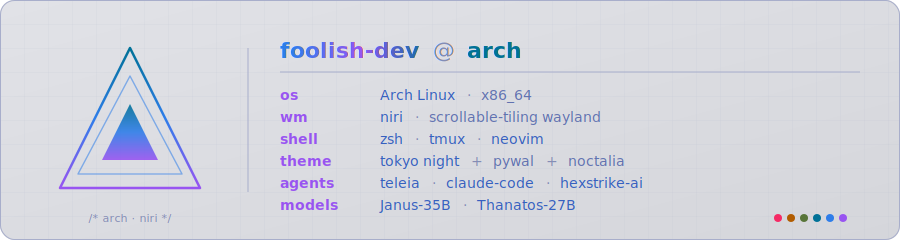

[](https://github.com/foolish-dev)

```console
foolish@arch ~ $ whoami
foolish-dev  ·  FoolDev @ hugging face
foolish@arch ~ $ cat .plan
// build small models, sharp tools, and a desktop i can rebuild from scratch.
```

fine-tuned llms, rust coding agents, and dotfiles that come up from bare metal — all on arch + niri + tokyo night. lowercase, terminal-native, no corporate voice.

---

```console
foolish@arch ~ $ hf ls FoolDev/   # qwen 3.6 fine-tunes
Janus-35B      lora moe   ~19 gb
Thanatos-27B   dense      ~17 gb
```

**[Janus-35B](https://huggingface.co/FoolDev/Janus-35B)** · **[Thanatos-27B](https://huggingface.co/FoolDev/Thanatos-27B)**

```sh
# run janus straight from the hub
ollama run hf.co/FoolDev/Janus-35B:Q4_K_M
# run thanatos straight from the hub
ollama run hf.co/FoolDev/Thanatos-27B:Q4_K_M
```

---

```console
foolish@arch ~ $ ls projects/
teleia   grogu
```

**[teleia](https://github.com/foolish-dev/teleia)** — rust tui coding agent
**[grogu](https://github.com/foolish-dev/grogu)** — one palette synced across niri · kitty · vim · tmux

---

```console
foolish@arch ~ $ neofetch --stdout
os        arch linux · x86_64
wm        niri · scrollable-tiling wayland
shell     zsh
editor    neovim
mux       tmux
theme     tokyo night + pywal + noctalia
agents    teleia · claude-code · hexstrike-ai
```

---

```console
foolish@arch ~ $ links
```

[github.com/foolish-dev](https://github.com/foolish-dev) · [huggingface.co/FoolDev](https://huggingface.co/FoolDev)

[](https://buymeacoffee.com/cardoffoolm)


```console
foolish@arch ~ $ █  // keep building, keep breaking.
```
